# Microservicio de Gestión de Tareas

## Introducción

Este proyecto constituye una implementación original de un microservicio de gestión de tareas (TODO). El objetivo principal es demostrar cómo estructurar una aplicación empresarial siguiendo un diseño arquitectónico que separa las responsabilidades en capas bien definidas, facilitando el mantenimiento, las pruebas y la escalabilidad del sistema.

El desarrollo establece una separación clara entre el dominio de negocio, los casos de uso y los adaptadores de infraestructura, logrando así un código desacoplado y altamente testeable.

---

## Evidencias de Implementación

## Paso 1: Análisis de la Estructura del Proyecto

El proyecto `clean-service` organiza el código en una estructura jerárquica por capas que respeta las dependencias unidireccionales.

```bash
cd clean-service
tree src/main/java -L 3
```

La estructura resultante organiza el código en tres capas principales:

- **domain/**: Contiene las entidades de negocio y las interfaces (ports) que definen contratos sin depender de implementaciones concretas.
- **usecase/**: Implementa la lógica de aplicación, orquestando las operaciones del dominio.
- **adapter/**: Proporciona las implementaciones concretas tanto para la entrada (inbound) como para la salida (outbound) de datos.

Esta separación garantiza que el dominio permanezca independiente de frameworks y tecnologías específicas, permitiendo que la lógica de negocio sea reutilizable y fácilmente testeable.

---

## Paso 2: Exploración de la Capa de Dominio

La capa de dominio constituye el núcleo de la aplicación y define los conceptos fundamentales del negocio sin ninguna dependencia hacia infraestructura o frameworks externos.

### Entidad Task

```bash
cat src/main/java/com/example/clean/domain/Task.java
```

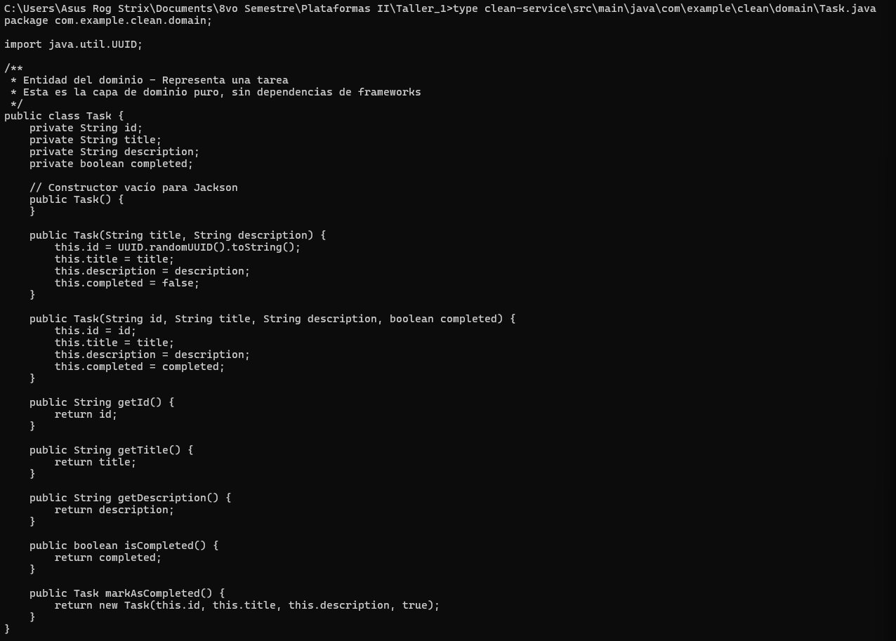

Esta clase representa la entidad `Task` con sus atributos esenciales (identificador, título, descripción y estado de completitud). Es importante notar que esta clase no contiene anotaciones de ningún framework (como `@Entity` de JPA o `@Service` de Spring), manteniéndose como un objeto Java puro (POJO).

### Interfaz TaskRepository

```bash
cat src/main/java/com/example/clean/domain/TaskRepository.java
```


La interfaz `TaskRepository` define el contrato para las operaciones de persistencia sin especificar cómo se implementarán dichas operaciones. Este es un ejemplo clásico del patrón de inversión de dependencias: el dominio define qué necesita, pero no cómo se proporciona. La implementación concreta podría utilizar cualquier tecnología de persistencia (memoria, base de datos relacional, NoSQL, etc.) sin afectar al dominio.

---

## Paso 3: Análisis de la Capa de Casos de Uso

La capa de casos de uso contiene la lógica de aplicación que coordina las operaciones del dominio según las reglas de negocio establecidas.

```bash
cat src/main/java/com/example/clean/usecase/TaskService.java
```


La clase `TaskService` implementa las operaciones principales del sistema:
- **Creación de tareas**: Valida que el título no esté vacío antes de persistir la tarea.
- **Consulta de tareas**: Permite obtener todas las tareas o buscar una específica por su identificador.
- **Completar tareas**: Actualiza el estado de una tarea existente.
- **Eliminación de tareas**: Remueve una tarea del sistema.

Esta clase recibe el repositorio a través de su constructor (inyección de dependencias), pero no conoce la implementación concreta del mismo. Además, no contiene anotaciones de Spring, siendo configurada manualmente en la clase de aplicación principal para mantener la independencia del framework.

---

## Paso 4: Exploración de la Capa de Adaptadores

Los adaptadores son las implementaciones concretas que conectan el núcleo de la aplicación con el mundo exterior, ya sea para recibir peticiones o para persistir datos.

### Adaptador de Entrada (Controlador REST)

```bash
cat src/main/java/com/example/clean/adapter/inbound/TaskController.java
```

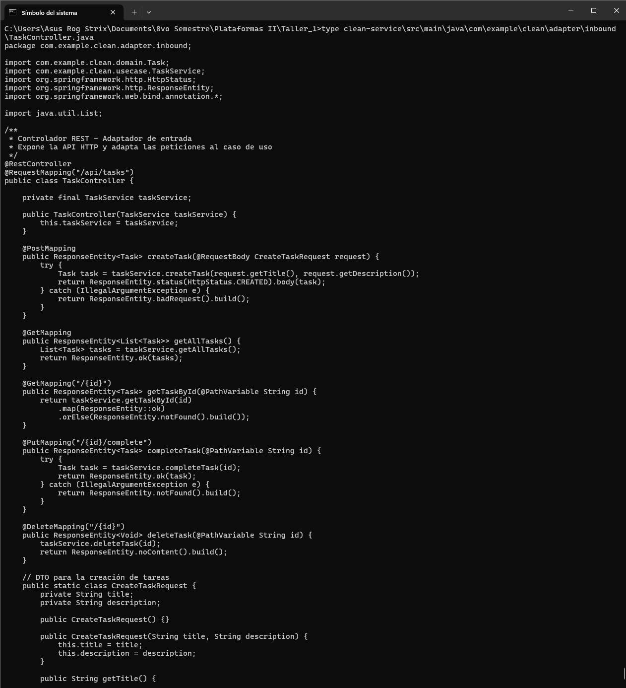

Este controlador expone los endpoints HTTP que permiten interactuar con el microservicio. Utiliza las anotaciones de Spring Web (`@RestController`, `@PostMapping`, etc.) para mapear las peticiones HTTP a los métodos correspondientes. El controlador transforma los datos de entrada (DTOs) y delega toda la lógica de negocio al `TaskService`, actuando únicamente como un adaptador entre el protocolo HTTP y la lógica de aplicación.

### Adaptador de Salida (Persistencia) y Configuración

```bash
cat src/main/java/com/example/clean/adapter/outbound/InMemoryTaskRepository.java
cat src/main/java/com/example/clean/CleanServiceApplication.java
```


La clase `InMemoryTaskRepository` implementa la interfaz `TaskRepository` utilizando un `ConcurrentHashMap` para almacenar las tareas en memoria. La anotación `@Repository` indica que es un componente de Spring, pero esta dependencia está contenida en la capa de adaptadores. Si en el futuro se requiere cambiar a una base de datos PostgreSQL o MongoDB, solo sería necesario crear un nuevo adaptador sin modificar el dominio ni los casos de uso.

La clase `CleanServiceApplication` configura manualmente el `TaskService` como un `@Bean`, manteniendo la independencia del framework en la capa de casos de uso.

---

## Paso 5: Ejecución de las Pruebas

Las pruebas son un componente fundamental para garantizar la calidad y el correcto funcionamiento del sistema. El proyecto incluye tanto pruebas unitarias como pruebas de integración.

### Pruebas Unitarias - TaskServiceTest

```bash
cd clean-service
cat src/test/java/com/example/clean/usecase/TaskServiceTest.java
```

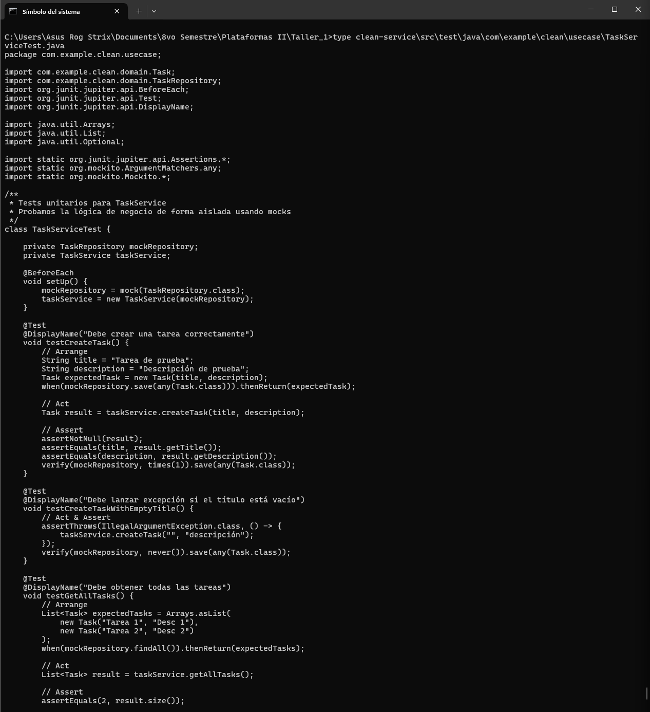

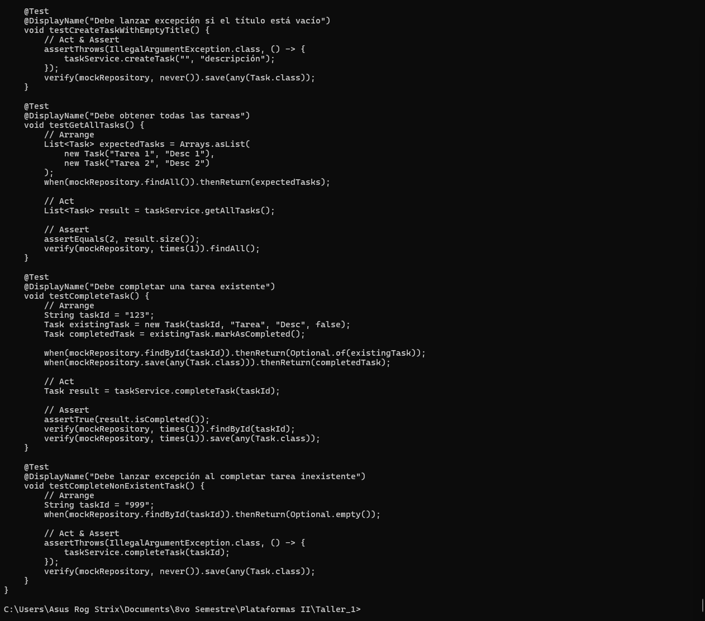

Las pruebas unitarias utilizan Mockito para simular el comportamiento del repositorio, permitiendo probar la lógica de negocio de forma aislada sin necesidad de levantar el contexto de Spring ni utilizar una base de datos real. Esto resulta en pruebas extremadamente rápidas y enfocadas exclusivamente en la lógica del caso de uso.

### Pruebas de Integración - TaskControllerIntegrationTest

```bash
cat src/test/java/com/example/clean/adapter/inbound/TaskControllerIntegrationTest.java
```


Las pruebas de integración utilizan `@SpringBootTest` y `MockMvc` para probar los endpoints HTTP de manera completa, validando el flujo desde el controlador hasta el repositorio.

### Ejecución de Tests

```bash
cd clean-service
./mvnw test
```


El resultado esperado muestra que se ejecutaron 8 pruebas en total: 5 pruebas unitarias en `TaskServiceTest` y 3 pruebas de integración en `TaskControllerIntegrationTest`, todas sin errores ni fallos.

### Reportes de Pruebas

```bash
cat target/surefire-reports/com.example.clean.usecase.TaskServiceTest.txt
cat target/surefire-reports/com.example.clean.adapter.inbound.TaskControllerIntegrationTest.txt
```


Los reportes de Surefire proporcionan información detallada sobre cada prueba ejecutada, incluyendo tiempos de ejecución y resultados individuales.

---

## Paso 6: Configuración del Proyecto

### Archivo de Configuración Maven y Propiedades

```bash
cat pom.xml
cat src/main/resources/application.properties
```

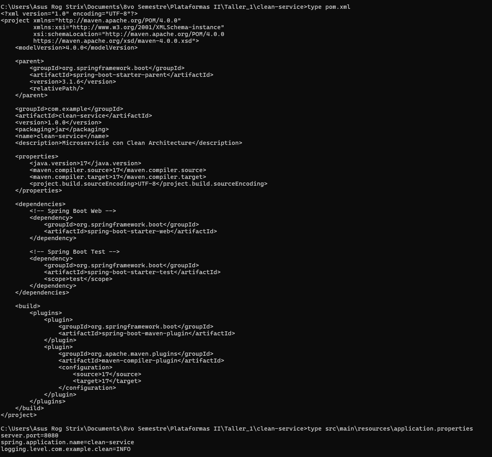

El archivo `pom.xml` define las dependencias del proyecto (Spring Boot, Spring Web, JUnit, Mockito) y la configuración de Maven. El archivo `application.properties` establece la configuración básica del servidor, como el puerto 8080.

---

## Paso 7: Construcción de la Imagen Docker

### Dockerfile Multi-Stage

```bash
cat clean-service/Dockerfile
```

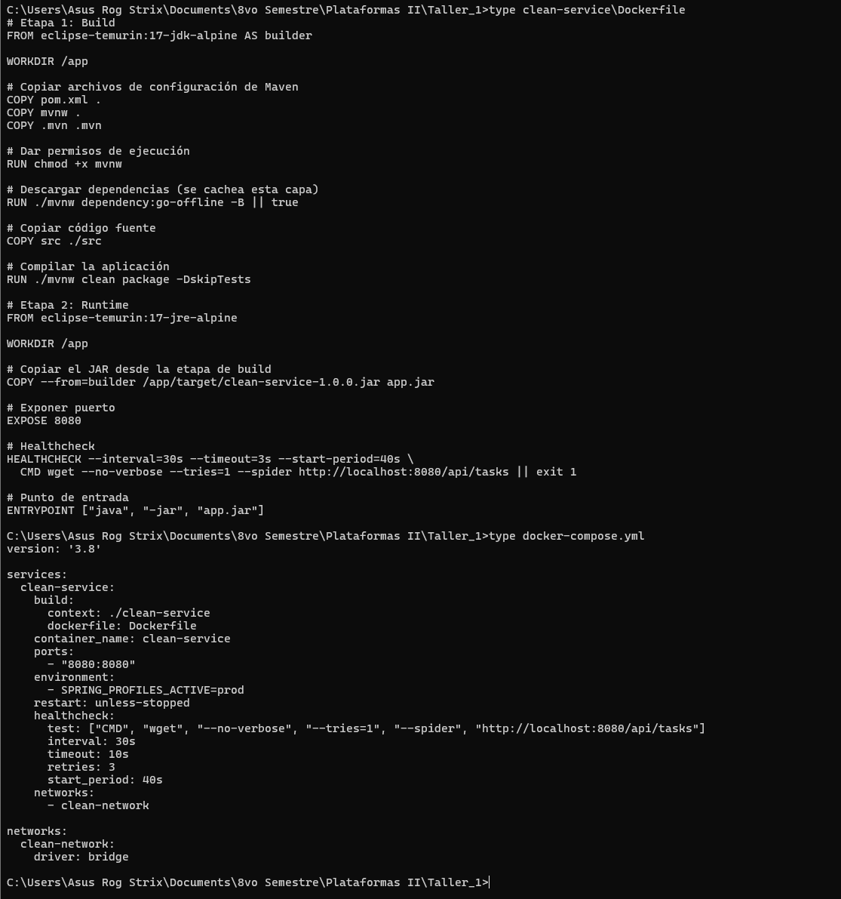

El proceso de construcción utiliza un Dockerfile multi-stage que optimiza el tamaño final de la imagen:

**Etapa 1 (Builder):** Utiliza una imagen con JDK completo y Maven para compilar el código fuente y generar el archivo JAR ejecutable.

**Etapa 2 (Runtime):** Copia únicamente el JAR compilado a una imagen con JRE (Java Runtime Environment), eliminando todas las herramientas de desarrollo y código fuente. Esto reduce significativamente el tamaño de la imagen final y mejora la seguridad al minimizar la superficie de ataque.

### Docker Compose

```bash
cat docker-compose.yml
```


El archivo `docker-compose.yml` define el servicio `clean-service` con su configuración de puertos, healthcheck y variables de entorno.

### Construcción de la Imagen

```bash
docker compose build
```


Este comando construye la imagen Docker siguiendo las instrucciones del Dockerfile. El proceso compila el código fuente, ejecuta Maven, y crea una imagen optimizada lista para producción.

---

## Paso 8: Despliegue del Microservicio

Una vez construida la imagen, se procede a iniciar el contenedor que ejecutará el microservicio.

```bash
docker compose up -d
docker compose ps
docker compose logs clean-service
```

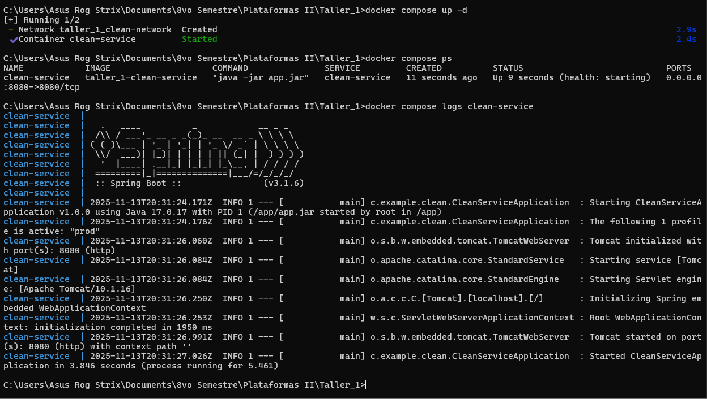

El flag `-d` (detached) indica que el contenedor debe ejecutarse en segundo plano. Los comandos posteriores verifican el estado del contenedor y muestran los logs de inicio.

El servicio debe aparecer con estado `Up` y la indicación `(healthy)`, lo que significa que el healthcheck configurado en Docker Compose está funcionando correctamente. Los logs muestran que Spring Boot ha inicializado correctamente y Tomcat está escuchando en el puerto 8080.

---

## Paso 9: Verificación de Funcionalidad - Operaciones CRUD

Con el servicio en ejecución, se demuestran todas las operaciones CRUD sobre la API REST expuesta.

### Crear Tareas y Consultar (POST y GET)

```bash
# Crear primera tarea
curl -X POST http://localhost:8080/api/tasks \
  -H "Content-Type: application/json" \
  -d '{"title":"Configurar Docker","description":"Crear Dockerfile multi-stage y docker-compose para despliegue"}'

# Crear segunda tarea
curl -X POST http://localhost:8080/api/tasks \
  -H "Content-Type: application/json" \
  -d '{"title":"Disenar arquitectura del sistema","description":"Definir capas de dominio, casos de uso y adaptadores del sistema"}'

# Listar todas las tareas
curl http://localhost:8080/api/tasks
```

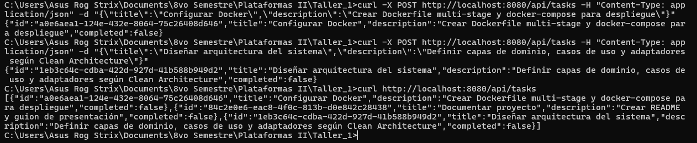

Se crean múltiples tareas y luego se consultan todas. La respuesta muestra un array JSON con todas las tareas almacenadas, cada una con su identificador único, título, descripción y estado de completitud.

### Completar Tarea (PUT)

```bash
# Marcar tarea como completada
curl -X PUT http://localhost:8080/api/tasks/a0e6aea1-124e-432e-8064-75c26408d646/complete

# Verificar el cambio
curl http://localhost:8080/api/tasks
```

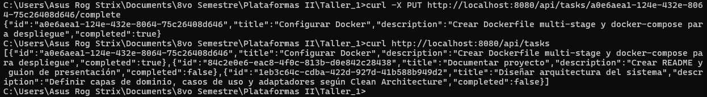

Al marcar una tarea como completada, el campo `completed` cambia de `false` a `true`. La consulta posterior confirma que el estado se actualizó correctamente en el sistema.

### Eliminar Tarea (DELETE)

```bash
# Eliminar tarea
curl -X DELETE http://localhost:8080/api/tasks/a0e6aea1-124e-432e-8064-75c26408d646

# Verificar la eliminación
curl http://localhost:8080/api/tasks
```

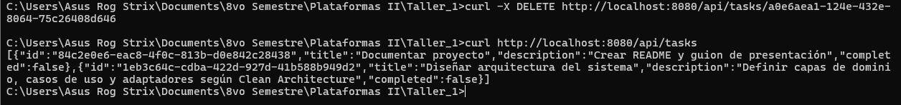

Después de eliminar una tarea, la consulta subsiguiente muestra que ya no aparece en la lista de tareas, confirmando que fue removida exitosamente del sistema.

---

## Paso 10: Monitoreo de Logs en Tiempo Real

Para observar el comportamiento interno del microservicio en tiempo real:

```bash
docker compose logs -f clean-service
```

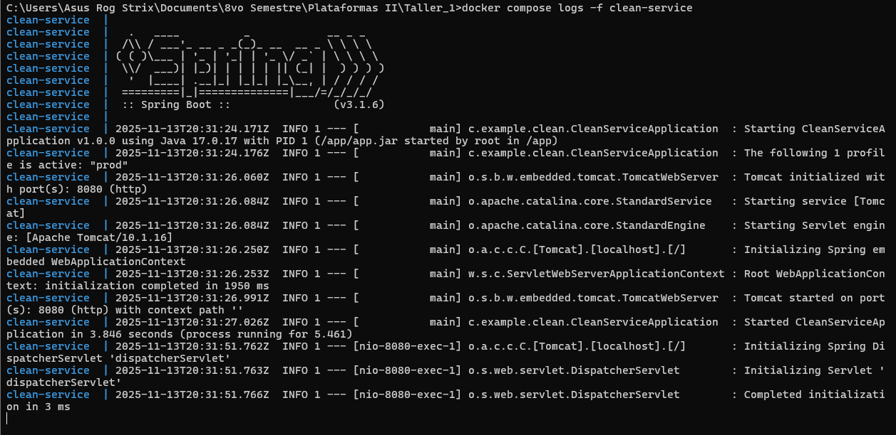

Este comando muestra los logs del contenedor de forma continua (flag `-f` de follow). Se pueden observar todas las peticiones HTTP recibidas, las operaciones ejecutadas y cualquier mensaje de log generado por la aplicación. Para detener la visualización de logs, presionar `Ctrl+C`.

---

## Paso 11: Detención del Servicio

Cuando se finaliza el trabajo con el microservicio:

```bash
docker compose down
docker compose ps
```

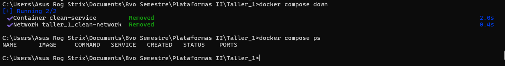

Este comando detiene y elimina los contenedores en ejecución. La verificación con `docker compose ps` confirma que no hay contenedores activos. Las imágenes Docker permanecen almacenadas localmente para facilitar futuros despliegues sin necesidad de reconstruirlas.

---

## Resultados Obtenidos

Este proyecto ha permitido demostrar los siguientes aspectos:

1. **Separación de responsabilidades**: El código está organizado en capas con dependencias unidireccionales (domain ← usecase ← adapters).

2. **Independencia del dominio**: Las entidades de negocio no dependen de frameworks externos, permitiendo cambios tecnológicos sin afectar la lógica central.

3. **Testabilidad**: Las pruebas unitarias se ejecutan sin necesidad de infraestructura, mientras que las pruebas de integración validan el funcionamiento completo del sistema.

4. **Contenedorización**: La aplicación está empaquetada en una imagen Docker optimizada, lista para despliegue en cualquier entorno compatible.

5. **API REST funcional**: El microservicio expone endpoints HTTP para todas las operaciones CRUD sobre tareas.

---

## Análisis Comparativo

**Enfoque Tradicional (Arquitectura en Capas):**
- La lógica de negocio está acoplada a frameworks específicos (Spring, JPA, etc.)
- Las pruebas requieren levantar el contexto completo de la aplicación
- Cambiar de tecnología implica modificaciones extensas en múltiples capas
- La estructura dificulta la comprensión de las reglas de negocio

**Enfoque con Arquitectura en Capas:**
- El dominio permanece independiente de frameworks y tecnologías
- Las pruebas son rápidas y focalizadas en la lógica de negocio
- Los cambios tecnológicos se aíslan en los adaptadores
- Cada capa tiene una responsabilidad claramente definida

---

## Estructura de Archivos del Proyecto

**Capa de Dominio:**
- `clean-service/src/main/java/com/example/clean/domain/Task.java`
- `clean-service/src/main/java/com/example/clean/domain/TaskRepository.java`

**Capa de Casos de Uso:**
- `clean-service/src/main/java/com/example/clean/usecase/TaskService.java`

**Capa de Adaptadores:**
- `clean-service/src/main/java/com/example/clean/adapter/inbound/TaskController.java`
- `clean-service/src/main/java/com/example/clean/adapter/outbound/InMemoryTaskRepository.java`

**Pruebas:**
- `clean-service/src/test/java/com/example/clean/usecase/TaskServiceTest.java`
- `clean-service/src/test/java/com/example/clean/adapter/inbound/TaskControllerIntegrationTest.java`

**Infraestructura:**
- `clean-service/Dockerfile`
- `docker-compose.yml`

**Documentación adicional:**
- `GUION_PRESENTACION.md` - Guion detallado para presentación académica de 30 minutos

---

## Secuencia de Comandos para Demostración

A continuación se presenta la secuencia completa de comandos para realizar una demostración del proyecto:

```bash
# 1. Visualización de la estructura del proyecto
tree clean-service/src/main/java -L 3

# 2. Ejecución de pruebas automatizadas
cd clean-service && ./mvnw test

# 3. Despliegue del microservicio
cd .. && docker compose up -d

# 4. Creación de una tarea de ejemplo
curl -X POST http://localhost:8080/api/tasks \
  -H "Content-Type: application/json" \
  -d '{"title":"Demostración en vivo","description":"Prueba de funcionalidad del microservicio"}'

# 5. Consulta de todas las tareas
curl -s http://localhost:8080/api/tasks | jq '.'

# 6. Inspección de logs del contenedor
docker compose logs clean-service | tail -20

# 7. Detención del servicio
docker compose down
```

---

## Conclusiones

Este proyecto constituye una implementación práctica de un microservicio de gestión de tareas con arquitectura por capas. La arquitectura propuesta permite mantener el código organizado, testeable y preparado para evolucionar según los requisitos futuros, demostrando los beneficios de aplicar principios de diseño sólidos en el desarrollo de software empresarial.